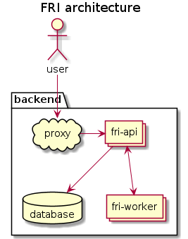
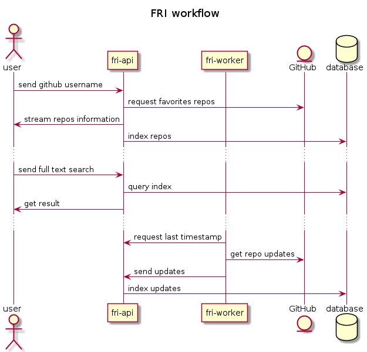

Favorite Repository Index
=========================

- [tl;dr](#tldr)
- [Motivation](#motivation)
- [The Challenge](#challenge)
- [Roadmap](#roadmap)
  - [Packages Management](#packages-management)
  - [Database](#database)
  - [Interfaces Definition](#interfaces-definition)
  - [Api Service](#api-structure)
  - [GitHub Queries](#github-queries)
  - [Database Queries](#database-queries)
  - [Worker API](#client-api)
  - [Client API](#client-api)
  - [Proxy](#proxy)
  - [User Interface](#user-interface)
  - [Left Over](#left-over)


<a id="tldr"></a>

# tl;dr

This project implements a simple service named Favorite Repository Index (FRI). The service let user registers by indexing their favorite repositories, then the service enable the user to perform full text search. When multiple users use the service, it can display the most popular repository amongs the registered users.

The goal is to implement an incremental roadmap using architectural decision records ([ADR](https://adr.github.io)).






<a id="motivation"></a>

# Motivation

I introduced a purely functional and strongly typed component, named [Lentille](https://github.com/change-metrics/lentille), while working on adding task datas to the [Monocle](https://github.com/change-metrics/monocle) service. I used Lentille to showcase a practical application of the Haskell language: performing data processing of the bugzilla API. Then, I investigated how one could leverage this approach for the rest of the service, in particular, the web api and client which are written in Python and Javascript.

So my idea was to use an IDL such as OpenAPI or Protobuf to implement the next features while keeping the existing code in place. Before working around the existing code base, I wanted to investigate using Haskell and gRPC in a greenfield project first.

I'm pretty satisfied with the result, and I'm eager to share my approach with you!


<a id="challenge"></a>

# The Challenge

TODO: define the goal and the challenges of Monocle.


<a id="roadmap"></a>

# Roadmap

> This roadmap is a work in progress. Once the project reachs a desirable state, each step will be mapped to a standalone commit.


<a id="packages-management"></a>

## Packages Management

[Choice of package manager record](./doc/adr/choice-of-packages-manager.md)

-   A shell environment with development tools installed:

```
$ nix-shell --pure
[nix-shell]$ which strace
/nix/store/6yf85zvdchma8khwa7gl4ng6h3b4yr9n-strace-5.11/bin/strace
```

-   Ready to use command to operate the service:

```
$ fri-start
[+] Starting the database...
[+] Start the api...
```


<a id="database"></a>

## Database

[Choice of elasticsearch record](https://github.com/change-metrics/monocle/blob/master/doc/adr/0002-choice-of-elasticsearch.md)

-   elasticsearch service deployment:

```
$ elk-start
Starting the database...

$ curl localhost:9242
{ "name": "fri", ..., "tagline" : "You Know, for Search"}

$ elk-stop
Stoping the database...

$ elk-destroy
Deleting the database...
```


<a id="interfaces-definition"></a>

## Interfaces Definition

[Choice of protobuf record](https://github.com/change-metrics/monocle/blob/master/doc/adr/0010-choice-of-protobuf.md)

-   protobuf definitions of the api: [fri.proto](./protos/fri.proto)

-   haskell, javascript and python code generation:

```
$ protobuf-codegen
Haskell bindings:
compile-proto-file --proto protos/fri.proto --out src/

Python bindings:
python3 -m grpc_tools.protoc -Iprotos --python_out=python/ --grpc_python_out=python/ fri.proto

Javascript bindings:
protoc -I=protos fri.proto --js_out=import_style=commonjs:javascript/src/ --grpc-web_out=import_style=commonjs,mode=grpcwebtext:javascript/src/
```


<a id="api-structure"></a>

## Api Service

[Choice of language record](https://github.com/change-metrics/lentille/blob/main/doc/adr/0002-choice-of-language.md)

-   A package set with relude version 1.0:

```
$ ghc-pkg list relude
    relude-1.0.0.1
```

-   A REPL:

```
$ cabal repl -O0
Ok, five modules loaded.
λ> import Api
λ> :type Api.run
Api.run :: Int -> IO ()
```

-   A CLI to start the service:

```
$ cabal run fri-api -- --elk-url http://localhost:9242 --port 8042
fri-api running on :8042
```


<a id="github-queries"></a>

## GitHub Queries

-   A haskell module to define crawler functions ([Fri.GitHub](./src/Fri/GitHub.hs)):

```haskell
getFavorites :: MonadIO m => UserName -> Stream (Of RepoInitial) m ()
```

-   REPL tutorial:

```haskell
λ> S.print $ Fri.GitHub.getFavorites (UserName "TristanCacqueray")
RepoInitial {riName = RepoName "haskellfoundation/matchmaker", riDescription = Just (RepoDescription {unDesc = "Find your open-soulmate <\128156>"})}
RepoInitial {riName = RepoName "Gabriel439/grace", riDescription = Just (RepoDescription {unDesc = "A ready-to-fork interpreted, typed, and functional language"})}
...
```


<a id="database-queries"></a>

## Database Queries

-   A haskell module to define elasticsearch query ([Fri.Query](./src/Fri/Query.hs)):

```haskell
addRepos :: (MonadThrow m, MonadIO m) => V.Vector RepoInitial -> Query m ()
```

-   REPL tutorial:

```haskell
λ> newClient "http://localhost:9242" >>= flip runQuery getIndices
[IndexName "fri.0"]
```


<a id="client-api"></a>

## Worker API

-   A haskell module to define worker ([Fri.Worker](./src/Fri/Worker.hs)):

```haskell
-- TODO
indexTags :: undefined
```

-   REPL tutorial:

```haskell
λ> TODO
```

-   A CLI to start the service:

```
$ cabal run fri-worker -- --api-endpoint localhost:8042
```


<a id="client-api"></a>

## Client API

-   TODO: API implementation

-   REPL tutorial:

```haskell
λ> TODO
```


<a id="proxy"></a>

## Proxy

[Choice of envoyproxy record](https://github.com/change-metrics/monocle/issues/345)

-   envoy service deployment:

```
$ envoy -c conf/envoy.yaml
starting main dispatch loop
```


<a id="user-interface"></a>

## User Interface

-   Live development server:

```
$ cd javascript; pnpm start
> react-scripts start
```


<a id="left-over"></a>

## Left Over

-   Authentication (openid, jwt, &#x2026;).
-   Standalone cli (compose service function in a TUI).
-   Distribution (container, vm, ansible, &#x2026;).
-   Service auto scaling.
-   CI with cachix.
